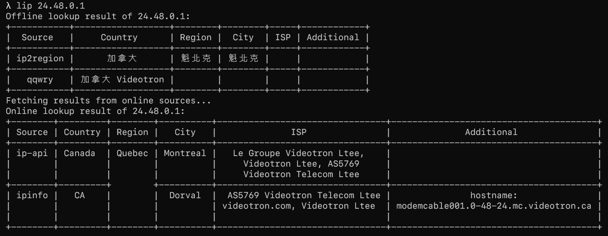
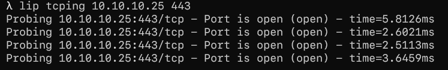

# lip - Look up IP

`lip` is a versatile command-line interface (CLI) tool that enables users to look up IP addresses and perform a wide range of additional functions. With `lip`, users can easily look up IP addresses, both for IPv4 and IPv6, and obtain detailed information about the associated domain names, subnets, and geolocations.

*This project is under development currently.*

## Install

You can install `lip` with the go command below:

```bash
go install github.com/juzeon/lip@latest
```

## Usage

Type `lip -h` for help.

## Screenshots




## Todos

- [x] IP Lookup
- [x] TCPing
- [ ] Telnet
- [ ] WHOIS lookup
- [ ] Reverse DNS lookup
- [ ] SSL Certificate Check
- [ ] Bandwidth Test